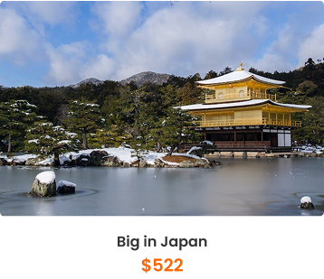

<!DOCTYPE html>
<html lang="en">
<head>

    <meta charset="UTF-8">
    <meta name="viewport" content="width=device-width, initial-scale=1.0">
    <title>Agência de Viagem</title>
    <link rel="stylesheet" href="Estilo.css">
    

</head>

<header>

    <h1 class="text-center flex ml-[40%] text-4xl font-bold"> Travel</h1>
    
    

    <a href="" class="hover:bg-gray-500" style="text-decoration: none; color: black;" >Home</a>
    <a href="" class="hover:bg-gray-500" style="text-decoration: none; color: black;" >Tour List</a>
    <a href="" class="hover:bg-gray-500" style="text-decoration: none; color: black;" >Destinations</a>
    <a href="" class="hover:bg-gray-500" style="text-decoration: none; color: black;" >Discounts</a>

    

</header>
<body>

    

        <h2 class="text-center py-16 text-[36px] text-white">
          
            <h2 class="font-[fantasy] text-white text-center mb-[55px] text-2xl"> let's go now</h2>

            <h3 class="text-[80px] text-white font-[fantasy] text-center mb-[35px]">explore</h3>

            <h3 class="text-[80px] text-white font-[fantasy] text-center mb-[25px]">and travel</h3>
            
            <button class="bg-[#74CC01] text-white px-6 py-3 rounded-md font-semibold hover:brightness-90 transition ml-[40%]">
               
                VIEW OUR TOURS

            </button>
            
        </h2>

    

    

        

            

            

            

            

        

    

    

    <h2 class="font-[fantasy] text-center text-[#FF6403] text-2xl">choose your</h2>

    <h2 class="font-bold text-center text-7xl">Perfect </h2>
    
    <h2 class="font-bold text-center text-8xl">Holiday</h2>

    

        

    

    

    <h2 class="text-center text-[26px] font-sans mb-[6rem]">The most searched holiday destinations.</h2>

    

    

    

    
    
    
    
    

    <h2 class="font-[fantasy] text-[#FF6403] text-center mt-[250px] text-4xl"> Our presence</h2>

    <h2 class="text-center text-8xl mt-[32px]">Contact Us</h2>

    

        

    

    

        
    

    <h2 class="text-center text-2xl mt-[36px]">Travel makes one modest. You see what a</h2>
    <h2 class="text-center text-2xl mb-[16rem]">tiny place you occupy in the world</h2>

</body>

</html>
